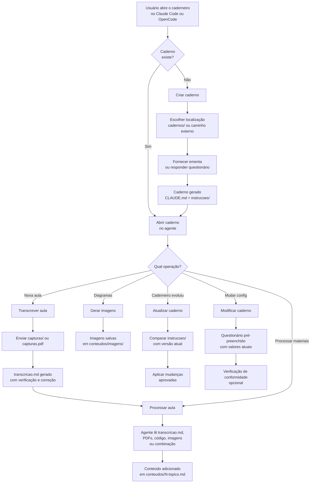
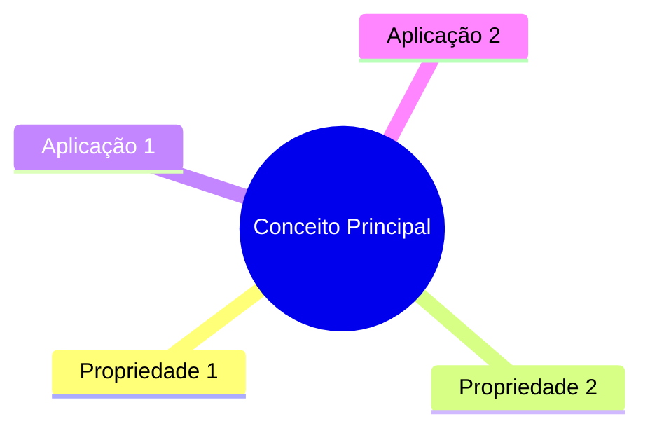

# 🗒️ Caderneiro

## ⚡ Operações Disponíveis

### O que é um caderno

Um **caderno** é o repositório de conhecimento de uma disciplina. Ele centraliza tudo em um só lugar: as instruções de como o agente deve operar, os conteúdos gerados a partir das aulas e os materiais brutos de entrada.

**Objetivo:** transformar materiais de aula dispersos (PDFs, fotos de quadro, código) em documentação estruturada, navegável e autoexplicativa — para que qualquer pessoa possa aprender o conteúdo sem ter assistido às aulas.

**Estrutura de um caderno:**
```
nome-da-disciplina/
├── CLAUDE.md          ← contexto + mapa de operações (lean, ≤ 100 linhas)
├── instrucoes/        ← procedimentos por operação, carregados sob demanda
├── conteudos/         ← conteúdo processado, um arquivo por tópico
│   └── 1-topico.md
└── aulas/             ← materiais brutos originais
    └── aula-XX/
```

---

### Operações

| Operação | Quando usar |
|----------|-------------|
| **Criar caderno** | Primeira vez em uma disciplina — pergunta onde criar e qual ferramenta; gera `CLAUDE.md` e/ou `AGENTS.md` + `instrucoes/` |
| **Atualizar/Modificar caderno** | Propagar atualizações do caderneiro a um caderno existente, ou ajustar suas configurações |
| **Transcrever aula** | Converter `capturas/` ou `capturas.pdf` em `transcricao.md` |
| **Processar aula** | Integrar ao arquivo de tópico qualquer material em `aulas/aula-XX/` — transcrição, PDF, código, imagens ou combinação deles |
| **Gerar imagens** | Gerar imagens a partir dos prompts nos arquivos `.md` e remover os indicadores de pendência nos conteúdos |
| **Exportar conteúdo** | Sincronizar `conteudos/` + imagens com a plataforma de estudo (Notion, Obsidian, PDF, GitHub) |

**Onde ficam os cadernos:**
- **Dentro do caderneiro:** `caderneiro/cadernos/nome-disciplina/` — pasta `cadernos/` está no `.gitignore`; seus cadernos ficam privados
- **Fora do caderneiro:** qualquer caminho absoluto informado pelo usuário

As operações **Transcrever aula**, **Processar aula**, **Gerar imagens** e **Exportar conteúdo** são executadas a partir dos arquivos `instrucoes/` do caderno da disciplina.
> Operações adicionais podem existir conforme os módulos ativados no caderno.

---

## 📋 ÍNDICE

1. [Introdução](#1-introdução)
2. [Como Usar o Caderneiro](#2-como-usar-o-caderneiro)
3. [Questionário Interativo](#3-questionário-interativo)
4. [Templates Base](#4-templates-base)
5. [Módulos Opcionais](#5-módulos-opcionais)
6. [Adaptadores de Plataforma](#6-adaptadores-de-plataforma)
7. [Procedimento de Geração](#7-procedimento-de-geração)
8. [Exemplos Completos](#8-exemplos-completos)
9. [Validação e Checklist](#9-validação-e-checklist)

---

## 1️⃣ INTRODUÇÃO

### 🎓 Propósito

O **Caderneiro** é um sistema agnóstico para criar e operar cadernos acadêmicos — repositórios de conhecimento por disciplina. Ele gera instruções detalhadas (CLAUDE.md + `instrucoes/`) adaptadas a:

- **Diferentes tipos de curso:** Técnico, Teórico, Híbrido
- **Diferentes plataformas:** Notion, Obsidian, GitHub, LaTeX
- **Diferentes necessidades:** Com/sem código, com/sem exercícios, com/sem fórmulas matemáticas

### 🧩 Filosofia

**Modularidade + Personalização + Automação**

- **Modularidade:** Componentes reutilizáveis que podem ser combinados
- **Personalização:** Cada disciplina tem necessidades únicas
- **Automação:** Uma vez configurado, o processo se torna repetível

### 🎯 Objetivos

1. **Reduzir tempo de planejamento:** De horas para minutos
2. **Garantir consistência:** Todos os planos seguem padrões de qualidade
3. **Facilitar replicação:** Usar o mesmo sistema em múltiplas disciplinas
4. **Adaptar a contextos:** Flexível para diferentes áreas do conhecimento

### 📊 Resultados Esperados

Ao final do questionário, o **caderno da disciplina** estará pronto:
- ✅ `CLAUDE.md` lean com contexto e mapa de operações
- ✅ `instrucoes/` com os procedimentos ativos para a disciplina
- ✅ Padrões de qualidade configurados para o contexto específico

---

## 2️⃣ COMO USAR O CADERNEIRO

### 🔄 Fluxo de Uso



### 👤 Papéis

**Você (Usuário):**
- Fornece materiais da aula (fotos do quadro, PDFs, código)
- Responde às perguntas do agente quando necessário
- Valida e solicita ajustes no conteúdo gerado

**Agente de IA (Claude Code ou OpenCode):**
- Conduz a criação e configuração do caderno
- Transcreve, processa e estrutura o conteúdo automaticamente
- Carrega instruções sob demanda conforme a operação solicitada

### 📁 Estrutura de Arquivos Resultante

**Se o curso possui Conteúdo Programático:**
```
caderno-da-disciplina/
├── CLAUDE.md                              ← Lean: contexto + mapa de operações (≤ 100 linhas)
├── instrucoes/
│   ├── _padroes.md                        ← Padrões compartilhados (formatação, exercícios, glossário)
│   ├── transcrever-aula.md                ← Operação: fotos do quadro → transcricao.md
│   ├── processar-aula.md                  ← Operação: materiais da aula → arquivo de tópico
│   └── [outras operações].md             ← Uma por operação ativa
├── conteudos/                             ← Um arquivo por tópico do programa
│   ├── 1-nome-topico.md
│   ├── 2-nome-outro-topico.md
│   └── ...
└── aulas/                                 ← Materiais originais
    └── aula-XX/
        ├── slides.pdf
        ├── codigo.c
        └── ...
```

**Se o curso NÃO possui Conteúdo Programático:**
```
caderno-da-disciplina/
├── CLAUDE.md                              ← Lean: contexto + mapa de operações (≤ 100 linhas)
├── instrucoes/
│   ├── _padroes.md                        ← Padrões compartilhados
│   ├── transcrever-aula.md                ← Operação: fotos do quadro → transcricao.md
│   ├── processar-aula.md                  ← Operação: materiais da aula → arquivo de aula
│   └── [outras operações].md
├── conteudos/                             ← Um arquivo por aula
│   ├── 1-nome-da-aula.md
│   ├── 2-quicksort.md
│   └── ...
└── aulas/                                 ← Materiais originais
    └── aula-XX/
        ├── slides.pdf
        ├── codigo.c
        └── ...
```

**Convenção de nomenclatura (ambos os casos):**
- Letras minúsculas, palavras separadas por hífen
- Prefixo numérico (`1-`, `2-`, etc.)
- **Sem o conectivo "de"** (ex.: `algoritmos-ordenacao`, não `algoritmos-de-ordenacao`)

### ⚠️ Conceitos Importantes

**Caderno:**
- **Caderno** = a pasta da disciplina com todo o seu conteúdo: `CLAUDE.md` + `instrucoes/` + `conteudos/` + `aulas/`
- Cada disciplina tem exatamente um caderno
- O caderno é criado pela operação **Criar caderno** e cresce incrementalmente a cada aula processada

**IMUTÁVEL vs INCREMENTAL:**

- **CLAUDE.md = IMUTÁVEL + LEAN**
  - Criado uma vez no início, nunca modificado após criação
  - Máximo ~100 linhas: apenas contexto da disciplina + mapa de operações
  - Aponta para `instrucoes/` — o agente lê o arquivo de operação sob demanda
  - Se precisar mudar: criar novo CLAUDE.md em nova versão

- **instrucoes/_padroes.md = IMUTÁVEL**
  - Padrões compartilhados por todas as operações (formatação, exercícios, glossário, checklist)
  - Criado junto com o CLAUDE.md

- **instrucoes/[operacao].md = IMUTÁVEL**
  - Um arquivo por operação disponível (ex: `processar-aula.md`, `transcrever-aula.md`)
  - Carregado pelo agente apenas quando aquela operação é solicitada
  - Operações disponíveis dependem dos módulos selecionados no questionário

- **Arquivos de tópico/aula = INCREMENTAIS (conteúdo)**
  - Um arquivo por tópico do Conteúdo Programático **ou** um por aula (se não houver programa)
  - Criado quando a primeira aula do tópico é processada
  - Novas aulas do mesmo tópico são **acrescentadas** ao arquivo existente

---

## 3️⃣ QUESTIONÁRIO INTERATIVO

### 📝 Instruções para o Agente de IA

Quando um usuário solicitar **Criar caderno** (nova disciplina) ou **Modificar caderno** (caderno existente), você deve:

1. **Identificar a operação** — Criar (sem caderno existente) ou Modificar (caderno já existe)
2. **Começar pela ementa** — antes de qualquer pergunta, verificar se há arquivo de ementa disponível
3. **Fazer perguntas de forma conversacional**, seção por seção
4. **Usar a ementa ou configuração atual para pré-preencher e sugerir respostas** sempre que possível
5. **Confirmar entendimento antes de avançar**
6. **Documentar todas as respostas para uso posterior**

---

### 🔄 Operação: ATUALIZAR/MODIFICAR CADERNO

Executar quando o usuário pedir para atualizar ou modificar um caderno existente — funciona tanto para cadernos em `cadernos/` quanto em caminhos externos.

Primeiro, identificar o caderno a operar:
```
"Qual caderno deseja atualizar/modificar?"
- Listar cadernos em cadernos/ (se existirem)
- Ou informar caminho externo
```

Em seguida, perguntar a intenção:

```
"O que deseja fazer?"

A) Atualizar — o caderneiro foi atualizado e quero propagar as mudanças para este caderno
B) Modificar — quero alterar as configurações do caderno (público-alvo, módulos, plataforma, etc.)
```

---

#### Fluxo A — Atualizar caderno

Usar quando o caderneiro evoluiu (novos módulos, procedimentos revisados, padrões atualizados) e o usuário quer que o caderno existente reflita essas melhorias.

**Passo 1 — Comparação de arquivos de contexto e instrução**

Verificar primeiro os arquivos de contexto do caderno conforme a ferramenta configurada (`{{FERRAMENTA}}`):
- `CLAUDE.md`: deve existir se `{{FERRAMENTA}} == CLAUDE_CODE` ou `AMBAS`
- `AGENTS.md`: deve existir se `{{FERRAMENTA}} == OPENCODE` ou `AMBAS`
- `opencode.json`: deve existir se `{{FERRAMENTA}} == OPENCODE` ou `AMBAS`

Para cada arquivo ausente ou desatualizado, perguntar se deve ser criado/atualizado.

Em seguida, comparar cada arquivo em `instrucoes/` do caderno com a versão atual equivalente no caderneiro. Para cada arquivo que divergir:

```
📄 instrucoes/[arquivo].md
   Situação: versão do caderno difere da versão atual do caderneiro
   Principais diferenças: [resumo do que mudou]

   Deseja atualizar este arquivo? (Sim / Não / Ver diff completo)
```

- Se **Sim**: substituir pelo arquivo atualizado do caderneiro
- Se **Não**: manter a versão atual do caderno
- Se **Ver diff**: mostrar as diferenças detalhadas antes de decidir

**Passo 2 — Relatório de atualização**

```
✅ Atualização concluída
📄 Arquivos atualizados: N
⏭️ Arquivos mantidos: N
```

---

#### Fluxo B — Modificar caderno

Usar quando o usuário quer alterar as configurações do caderno (não relacionado a atualizações do caderneiro).

**Passo 1 — Leitura do caderno atual**

Ler o `CLAUDE.md` do caderno e extrair todas as configurações atuais:
- Contexto da disciplina (nome, professor, instituição, etc.)
- Módulos ativos (`instrucoes/` existentes)
- Mapeamento tópico → arquivo
- Plataforma e padrões vigentes

**Passo 2 — Questionário com respostas pré-sugeridas**

Percorrer as seções do questionário (Seções 1 a 10), com cada pergunta pré-preenchida com o valor atual:

```
Para cada pergunta do questionário:
  - Exibir o valor atual como sugestão padrão
  - Perguntar: "Deseja manter [valor atual] ou alterar?"
  - Se manter: avançar sem mudança
  - Se alterar: registrar novo valor
```

Ao final, apresentar resumo apenas das mudanças feitas.

**Passo 3 — Verificação de conformidade (opcional)**

Após o questionário, perguntar:

```
"Deseja verificar se o caderno está em conformidade com os requisitos do Caderneiro?"
```

Se **sim**, percorrer o checklist da Seção 9 item a item. Para cada ponto divergente:

```
⚠️ [Descrição do ponto]
   Situação atual: [o que está no caderno]
   Esperado: [o que o Caderneiro requer]

   Deseja corrigir? (Sim / Não / Ver detalhes)
```

Relatório ao final:
```
✅ Conformidade: N/M pontos
⚠️ Corrigidos: N pontos
🔕 Aceitos com divergência: N pontos
```

**Passo 4 — Aplicar mudanças**

Reescrever o `CLAUDE.md` e os arquivos de `instrucoes/` afetados com as alterações aprovadas.

---

### 📤 Operação: EXPORTAR CONTEÚDO

Sincroniza os arquivos de `conteudos/` + imagens com a plataforma de estudo escolhida. A configuração é feita uma única vez por caderno e salva em `exportar.json`.

**Passo 1 — Verificar configuração**

Checar se `exportar.json` existe na raiz do caderno. Se não existir, perguntar:

```
"Para qual plataforma deseja exportar o conteúdo?"

A) Notion
B) Obsidian
C) PDF
D) GitHub / GitHub Pages
```

Exibir o tutorial de setup da plataforma escolhida (ver abaixo) e, ao final, salvar `exportar.json`.

**`exportar.json` (salvo na raiz do caderno, nunca versionado):**
```json
{
  "plataforma": "NOTION",
  "notion": {
    "page_id": "ID_DA_PAGINA_PAI",
    "token_env": "NOTION_TOKEN"
  }
}
```
> ⚠️ Adicionar `exportar.json` ao `.gitignore` do caderno — contém referências a tokens/paths sensíveis.

---

**Passo 2 — Executar exportação**

#### A) Notion

1. Para cada arquivo em `conteudos/imagens/`, fazer upload via Notion File Upload API:
   ```
   POST https://api.notion.com/v1/files
   Authorization: Bearer $NOTION_TOKEN
   Content-Type: multipart/form-data
   body: arquivo de imagem
   ```
   Guardar o mapeamento `caminho_local → url_notion` retornado.

2. Criar cópias temporárias dos `.md` de `conteudos/`, substituindo cada caminho local pela URL do Notion correspondente.

3. Sincronizar as cópias com `go-notion-md-sync push`.

4. Descartar as cópias temporárias. Os arquivos originais em `conteudos/` permanecem inalterados com caminhos locais.

**Tutorial de setup Notion:**
```
1. Acesse https://www.notion.so/profile/integrations
2. Clique em "New integration" → nomeie (ex: "caderneiro")
3. Copie o "Internal Integration Token"
4. Abra a página do Notion onde o conteúdo será publicado
5. Clique em "..." → "Connect to" → selecione sua integration
6. Copie o ID da página da URL (32 caracteres após o último "/")
7. Instale go-notion-md-sync: https://github.com/byvfx/go-notion-md-sync
8. Execute: export NOTION_TOKEN="seu_token"
9. Informe o page_id ao agente para salvar em exportar.json
```

---

#### B) Obsidian

```bash
cp -r conteudos/* {{CAMINHO_VAULT}}/
```

**Tutorial de setup Obsidian:**
```
1. Abra o Obsidian e vá em Configurações → Sobre
2. O caminho da vault aparece em "Vault path"
3. Informe este caminho ao agente para salvar em exportar.json
```

---

#### C) PDF (pandoc)

```bash
for f in conteudos/*.md; do
  pandoc "$f" -o "${f%.md}.pdf" --resource-path=conteudos/imagens
done
```

PDFs gerados na mesma pasta dos `.md` correspondentes.

**Tutorial de setup:**
```bash
# Ubuntu/Debian
sudo apt install pandoc

# macOS
brew install pandoc

# Verificar
pandoc --version
```

---

#### D) GitHub / GitHub Pages

```bash
git add conteudos/
git commit -m "conteúdo: sincronizar [$(date +%Y-%m-%d)]"
git push
```

**Tutorial de setup GitHub:**
```
1. Crie um repositório privado no GitHub para o caderno
2. Na pasta do caderno: git init && git remote add origin URL_DO_REPO
3. Configure autenticação (SSH key ou token)
4. Informe a URL do remote ao agente para salvar em exportar.json
```

---

### 📍 Passo -1: LOCALIZAÇÃO DO CADERNO

**Apenas para "Criar caderno". Pular para Passo 0 se for Atualizar/Modificar.**

```
"Onde deseja criar o caderno?"

A) Dentro do caderneiro — caderneiros/cadernos/[nome-disciplina]/
   Os cadernos ficam privados (pasta cadernos/ está no .gitignore).

B) Em outro diretório
   Informe o caminho completo onde o caderno será criado.
```

Armazenar em: `{{CAMINHO_CADERNO}}`
Usar em todos os passos seguintes para montar os caminhos dos arquivos gerados.

---

### 📄 Passo 0: EMENTA / CONTEÚDO PROGRAMÁTICO

**Este passo acontece antes de qualquer pergunta.**

```
"Você tem algum arquivo com a ementa ou conteúdo programático da disciplina?
(PDF, texto, imagem, ou pode colar o conteúdo aqui)"

Se SIM: ler o arquivo/conteúdo e extrair automaticamente:
  - Nome da disciplina → {{NOME_DISCIPLINA}}
  - Código → {{CODIGO_DISCIPLINA}}
  - Período → {{PERIODO}}
  - Professor(a) → {{PROFESSOR}}
  - Instituição → {{INSTITUICAO}}
  - Carga horária → {{CARGA_HORARIA}}
  - Lista de tópicos → {{TOPICOS}}
  - Tipo inferido → sugestão para Seção 2

Se NÃO: continuar para Seção 1 normalmente.
```

Após ler a ementa, apresentar um resumo do que foi extraído e pedir confirmação:
```
"Extraí as seguintes informações da ementa:
  - Disciplina: [valor]
  - Professor: [valor]
  - ...
Está correto? Alguma correção?"
```

---

### 🎯 Seção 1: IDENTIFICAÇÃO DA DISCIPLINA

**Objetivo:** Confirmar ou completar informações básicas.
Se a ementa foi fornecida no Passo 0, pular as perguntas já preenchidas e perguntar apenas as que ficaram em branco.

**1.1. Nome da Disciplina** *(obrigatório)*
```
Pergunta: "Qual é o nome completo da disciplina?"
Exemplo: "Estrutura de Dados II"
Armazenar em: {{NOME_DISCIPLINA}}
```

**1.2. Código da Disciplina** *(opcional)*
```
Pergunta: "Qual é o código da disciplina? (pode pular)"
Exemplo: "DCE16376"
Armazenar em: {{CODIGO_DISCIPLINA}}
```

**1.3. Período Letivo** *(opcional)*
```
Pergunta: "Qual período letivo? (pode pular)"
Exemplo: "2026/1"
Armazenar em: {{PERIODO}}
```

**1.4. Professor(a)** *(opcional)*
```
Pergunta: "Qual o nome do(a) professor(a)? (pode pular)"
Exemplo: "Profa. Dra. Maria Silva"
Armazenar em: {{PROFESSOR}}
```

**1.5. Instituição** *(opcional)*
```
Pergunta: "Qual instituição de ensino? (pode pular)"
Exemplo: "UFES - Campus São Mateus"
Armazenar em: {{INSTITUICAO}}
```

**1.6. Carga Horária** *(opcional)*
```
Pergunta: "Qual a carga horária semanal/total? (pode pular)"
Exemplo: "60h totais (4h/semana)"
Armazenar em: {{CARGA_HORARIA}}
```

---

### 🎓 Seção 2: TIPO DE CURSO

**Objetivo:** Determinar a natureza predominante do conteúdo.

Se a ementa foi fornecida no Passo 0, inferir o tipo e apresentar como sugestão:
```
Inferência baseada na ementa:
  - Palavras-chave como "implementação", "programação", "algoritmos", nomes de linguagens
    → sugerir TÉCNICA
  - Palavras-chave como "teoria", "prova", "demonstração", "fundamentos", "cálculo"
    → sugerir TEÓRICA
  - Mix de ambos → sugerir HÍBRIDA

Apresentar: "Com base na ementa, parece ser uma disciplina [TIPO]. Confirma?"
```

#### Pergunta Principal:

```
"Qual categoria melhor descreve sua disciplina?"

A) 💻 TÉCNICA/PRÁTICA (>60% código/implementação)
   - Programação, algoritmos, desenvolvimento
   - Exemplos: Estruturas de Dados, POO, Banco de Dados

B) 📚 TEÓRICA/CONCEITUAL (>60% teoria/conceitos)
   - Fundamentos, matemática, análise
   - Exemplos: Teoria da Computação, Cálculo, Lógica

C) ⚖️ HÍBRIDA/BALANCEADA (mix equilibrado)
   - Teoria + Prática em proporções similares
   - Exemplos: Sistemas Operacionais, Redes, IA

Sua resposta: ___ [sugestão pré-marcada se ementa disponível]
```

Armazenar em: `{{TIPO_CURSO}}`
Valores possíveis: `TECNICA | TEORICA | HIBRIDA`

> ℹ️ Refinamentos como linguagens usadas, nível de matemática e foco em algoritmos **não são perguntados aqui** — são inferidos progressivamente conforme as aulas são processadas.

---

### 🖥️ Seção 3: PLATAFORMA ALVO

**Objetivo:** Definir onde a documentação será consumida.

#### Pergunta Principal:

```
"Onde você pretende visualizar/usar a documentação final?"

A) 📘 NOTION
   - Interface visual rica
   - Suporta: toggles, callouts, databases
   - Ideal para: Navegação web, compartilhamento
   
B) 📝 OBSIDIAN
   - Editor markdown local
   - Suporta: wikilinks, tags, graph view
   - Ideal para: Uso offline, linking complexo
   
C) 🐙 GITHUB
   - Markdown padrão GitHub-flavored
   - Suporta: README.md, GitHub Pages
   - Ideal para: Portfólios, projetos open-source
   
D) 📄 LATEX/PDF
   - Documento acadêmico formal
   - Suporta: Referências, índices, formatação profissional
   - Ideal para: Impressão, submissão acadêmica

Sua resposta: ___
```

Armazenar em: `{{PLATAFORMA}}`
Valores possíveis: `NOTION | OBSIDIAN | GITHUB | LATEX`

#### Configurações automáticas por plataforma

Após a escolha da plataforma, o agente define automaticamente — sem perguntar ao usuário:

```
FORMATO_CALLOUT e SUPORTE_DIAGRAMAS são inferidos diretamente de {{PLATAFORMA}}:

NOTION:
  - Callout: > 💡 **Dica:** Texto
  - Diagramas: Mermaid ✅ | ASCII ✅

OBSIDIAN:
  - Callout: > [!note] Título \n > Texto
  - Diagramas: Mermaid ✅ | ASCII ✅

GITHUB:
  - Callout: > **Note** \n > Texto
  - Diagramas: Mermaid ✅ | ASCII ✅

LATEX:
  - Callout: \begin{tcolorbox}[title=Nota] ... \end{tcolorbox}
  - Diagramas: TikZ ✅ | ASCII ✅ | Mermaid ❌

Armazenar em: {{FORMATO_CALLOUT}} e {{SUPORTE_DIAGRAMAS}}
```

#### Ferramenta de IA

```
"Qual ferramenta de IA você usará para operar o caderno?"

A) Claude Code  — gera CLAUDE.md
B) OpenCode     — gera AGENTS.md + opencode.json
C) Ambas        — gera CLAUDE.md + AGENTS.md + opencode.json

Armazenar em: {{FERRAMENTA}}
Valores: CLAUDE_CODE | OPENCODE | AMBAS
```

> ℹ️ Se não tiver preferência, escolha **Ambas** — garante compatibilidade independente da ferramenta usada no futuro.

---

### 🧩 Seção 4: MÓDULOS OPCIONAIS

**Objetivo:** Selecionar componentes adicionais para o plano.

#### Introdução ao Usuário:

```
"Agora vamos selecionar componentes opcionais para sua documentação.
Cada módulo adiciona funcionalidades específicas.

Marque todos que você deseja incluir:"
```

#### 4.1. Módulo de ANÁLISE DE CÓDIGO

```
[ ] Incluir Módulo de Análise de Código

📦 O que este módulo adiciona:
  ✓ Instruções para comentar código linha por linha
  ✓ Templates para explicar funções/métodos
  ✓ Seções de análise de complexidade
  ✓ Exemplos de entrada/saída
  ✓ Identificação de padrões de design

🎯 Recomendado para:
  • Disciplinas com implementações (TÉCNICA/HÍBRIDA)
  • Cursos de programação, algoritmos, estruturas de dados

❌ NÃO recomendado para:
  • Cursos puramente teóricos sem código
```

Armazenar em: `{{MODULO_CODIGO}}`
Valores: `true | false`

#### 4.2. Módulo de DIAGRAMAS

```
[ ] Incluir Módulo de Diagramas

📦 O que este módulo adiciona:
  ✓ Guia de criação de diagramas Mermaid
  ✓ Templates para fluxogramas, árvores, grafos
  ✓ Instruções para ASCII art (quando Mermaid não serve)
  ✓ Regras de clareza e consistência visual
  ✓ Legendas e explicações obrigatórias

🎯 Recomendado para:
  • Estruturas de dados visuais (árvores, grafos, heaps)
  • Algoritmos com fluxos complexos
  • Arquiteturas e sistemas

⚠️ IMPORTANTE - Quando NÃO usar Mermaid:
  • Arrays com índices e valores lado a lado
  • Ponteiros e referências de memória
  • Estruturas de memória baixo nível
  
  → Nestes casos, usar:
     • ASCII art em blocos de código
     • Tabelas formatadas
     • Descrição textual detalhada

❌ NÃO recomendado para:
  • Disciplinas puramente textuais
```

Armazenar em: `{{MODULO_DIAGRAMAS}}`
Valores: `true | false`

#### 4.3. Módulo de EXERCÍCIOS

```
[ ] Incluir Módulo de Exercícios

📦 O que este módulo adiciona:
  ✓ Sistema de geração de exercícios por dificuldade
  ✓ Templates para enunciados e soluções
  ✓ Exercícios distribuídos por subtópico (não apenas no final)
  ✓ Soluções em toggles/expandable sections
  ✓ Classificação: Básico 🟢, Intermediário 🟡, Avançado 🔴

🎯 Recomendado para:
  • Qualquer disciplina onde prática é importante
  • Cursos com avaliações baseadas em exercícios

📊 Quantidade Adaptativa:
  • Tópicos Simples: 5-8 exercícios
  • Tópicos Médios: 9-12 exercícios
  • Tópicos Complexos: 13-20 exercícios
  
📐 Distribuição por Dificuldade:
  • 40% Básico (aplicação direta)
  • 40% Intermediário (combinação de conceitos)
  • 20% Avançado (problemas desafiadores)

❌ NÃO recomendado para:
  • Disciplinas puramente expositivas
```

Armazenar em: `{{MODULO_EXERCICIOS}}`
Valores: `true | false`

**Subpergunta 4.3.1 (se ativado):**
```
"Incluir soluções detalhadas nos exercícios?"
  (A) Sim, sempre com explicação completa
  (B) Sim, mas apenas gabarito resumido
  (C) Não, apenas enunciados

Armazenar em: {{EXERCICIOS_COM_SOLUCAO}}
```

#### 4.4. Módulo de GLOSSÁRIO

```
[ ] Incluir Módulo de Glossário

📦 O que este módulo adiciona:
  ✓ Seção de glossário por aula/tópico
  ✓ Definições técnicas padronizadas
  ✓ Formato expandible (toggle/details)
  ✓ Ordem alfabética automática

🎯 Recomendado para:
  • Disciplinas com muita terminologia técnica
  • Cursos introdutórios (muitos termos novos)
  • Áreas com jargão específico

📍 Localização:
  • OPÇÃO A: Glossário por aula (ao final de cada seção)
  • OPÇÃO B: Glossário global (seção separada ao final)

❌ NÃO recomendado para:
  • Disciplinas com poucos termos técnicos
```

Armazenar em: `{{MODULO_GLOSSARIO}}`
Valores: `true | false`

**Subpergunta 4.4.1 (se ativado):**
```
"Glossário por aula ou global?"
  (A) Por aula - Ao final de cada seção de aula
  (B) Global - Seção única ao final do documento

Armazenar em: {{GLOSSARIO_TIPO}}
```

#### 4.5. Módulo de FÓRMULAS MATEMÁTICAS

```
[ ] Incluir Módulo de Fórmulas Matemáticas

📦 O que este módulo adiciona:
  ✓ Suporte para LaTeX inline e display
  ✓ Templates para equações, somatórios, integrais
  ✓ Guia de formatação matemática
  ✓ Exemplos de demonstrações passo-a-passo

🎯 Recomendado para:
  • Cálculo, Álgebra, Análise
  • Algoritmos com análise matemática formal
  • Física, Estatística, Otimização

⚙️ Sintaxe por plataforma:
  • Notion: $$E = mc^2$$
  • Obsidian: $E = mc^2$
  • GitHub: $E = mc^2$ (suporte recente)
  • LaTeX: $E = mc^2$ (nativo)

❌ NÃO recomendado para:
  • Disciplinas sem matemática formal
  • Cursos apenas com aritmética básica
```

Armazenar em: `{{MODULO_FORMULAS}}`
Valores: `true | false`

#### 4.6. Módulo de REFERÊNCIAS

```
[ ] Incluir Módulo de Referências

📦 O que este módulo adiciona:
  ✓ Seção de referências bibliográficas
  ✓ Formatação ABNT ou outro padrão
  ✓ Links para recursos externos
  ✓ Material complementar recomendado

🎯 Recomendado para:
  • Trabalhos acadêmicos formais
  • Disciplinas com leituras obrigatórias
  • Documentação que será publicada/compartilhada

📚 Tipos de referência:
  • Livros didáticos
  • Artigos científicos
  • Documentação oficial
  • Vídeos/tutoriais
  • Repositórios GitHub

❌ NÃO recomendado para:
  • Notas de estudo pessoais simples
```

Armazenar em: `{{MODULO_REFERENCIAS}}`
Valores: `true | false`

#### 4.7. Módulo de MÍDIA

```
[ ] Incluir Módulo de Mídia

📦 O que este módulo adiciona:
  ✓ Instruções para processar imagens
  ✓ Embedding de vídeos
  ✓ Transcrição de áudios
  ✓ Capturas de tela anotadas

🎯 Recomendado para:
  • Aulas gravadas (vídeos)
  • Slides com muitas imagens
  • Tutoriais visuais

📁 Tipos suportados:
  • Imagens: PNG, JPG, SVG
  • Vídeos: YouTube, Vimeo (embed)
  • Áudios: Transcrição para texto

❌ NÃO recomendado para:
  • Material puramente textual
```

Armazenar em: `{{MODULO_MIDIA}}`
Valores: `true | false`

#### 4.8. Módulo de CONSISTÊNCIA NA GERAÇÃO

```
[x] Incluir Módulo de Consistência na Geração

📦 O que este módulo adiciona:
  ✓ Regras para prevenir erros recorrentes na geração de conteúdo
  ✓ Checklist de verificação antes de finalizar cada aula
  ✓ Padrões de qualidade para traces, diagramas e exercícios

🎯 Recomendado para:
  • TODOS os cursos (ativado por padrão)
  • Especialmente importante quando há código, diagramas ou exercícios

⚠️ Este módulo é ATIVADO POR PADRÃO — diferente dos demais,
   que são opcionais. Pode ser desativado explicitamente se desejado.
```

Armazenar em: `{{MODULO_CONSISTENCIA}}`
Valores: `true` (padrão) | `false`

#### 4.9. Módulo de TRANSCRIÇÃO DE MATERIAIS MANUSCRITOS

```
[ ] Incluir Módulo de Transcrição de Materiais Manuscritos

📦 O que este módulo adiciona:
  ✓ Procedimento em 3 etapas: transcrição → verificação → correção
  ✓ Regras para análise de ordem e completude de páginas
  ✓ Tratamento configurável de elementos visuais (diagramas, desenhos)
  ✓ Tabela de inconsistências com coluna de gravidade
  ✓ Relatório padronizado ao final de cada transcrição

🎯 Recomendado para:
  • Disciplinas com aulas presenciais em quadro/lousa
  • Materiais manuscritos digitalizados (PDFs de fotos)

⚡ Ativado automaticamente quando:
  • Seção 8 marcou "Fotos de quadro / materiais manuscritos"
  • Arquivo capturas.pdf encontrado em aulas/aula-XX/
```

Armazenar em: `{{MODULO_TRANSCRICAO}}`
Valores: `true | false`

**Regras que este módulo injeta no CLAUDE.md gerado:**

**Regra C1: Indexação coerente com a linguagem do curso**
```
Todos os traces de execução, exemplos e exercícios devem usar
a mesma convenção de indexação da linguagem {{LINGUAGENS}}:
  • C, Java, Python → base-0 (arrays começam em 0)
  • Pascal, Lua → base-1 (arrays começam em 1)
  • Pseudocódigo puro → definir explicitamente no início do documento

Verificação: ao gerar um trace, conferir se o primeiro valor de
cada variável de laço coincide com a inicialização no código.
```

**Regra C2: Código é fonte de verdade**
```
Quando o conteúdo apresenta um algoritmo com descrição textual
E implementação em código:
  1. Escrever o código primeiro
  2. Derivar a descrição textual a partir do código
  3. Nunca descrever uma variante na prosa e implementar outra no código
  4. Terminologia da prosa deve coincidir com o código
     (ex.: não dizer "laço Enquanto" se o código usa "while")

Verificação: após escrever código + descrição, percorrer o código
mentalmente e confirmar que cada if, for, while e swap corresponde
ao que o texto descreve.
```

**Regra C3: ASCII Art com posições calculadas**
```
Ao criar representações visuais de estruturas em blocos de código
(arrays com ponteiros, pilhas, filas, etc.):
  1. Escrever a estrutura e anotar a coluna de cada elemento
  2. Posicionar ponteiros/indicadores por cálculo, não por estimativa
  3. Conferir contando caracteres da linha resultante

Nunca "chutar" alinhamento visualmente — calcular antes de escrever.
```

**Regra C4: Diagramas Mermaid — critério e sintaxe**
```
Critério de uso:
  • Usar Mermaid quando o diagrama tem RELAÇÕES entre elementos
    (setas, hierarquia, fluxo)
  • Se a informação é apenas elementos lado a lado sem conexões,
    usar texto em bloco de código

Sintaxe obrigatória:
  • Quebra de linha em labels: usar <br/>, NUNCA \n
  • Nomes de nós semânticos (Level1_L["valor"] em vez de A["valor"])
  • Subgraphs para separar fases lógicas quando aplicável
  • Estilos com cores de contraste para diferenciar estados
```

**Regra C5: Sem rascunhos no conteúdo final**
```
O conteúdo entregue NUNCA deve conter:
  • Texto de auto-correção ("espera", "opa", "na verdade")
  • Tentativas falhas seguidas da versão correta
  • Comentários internos do processo de geração
  • Parênteses com correções inline

Se perceber um erro durante a geração: apagar o trecho errado
e escrever apenas a versão correta.
```

**Regra C6: Verificar soluções de exercícios**
```
Antes de incluir a solução de um exercício:
  1. Executar mentalmente o algoritmo/procedimento com a entrada
     do enunciado, passo a passo
  2. Conferir que o resultado bate com o que a solução afirma
  3. Se o exercício pede um trace: construir a partir do código
     (não da memória), respeitando C1 (indexação) e C2 (fidelidade)
```

---

### 📊 Seção 5: ESTRUTURA DE CONTEÚDO

**Objetivo:** Definir organização interna da documentação.

#### 5.1. Tabela de Controle

```
"Deseja incluir uma tabela de controle para acompanhar progresso?"

A tabela de controle ficará no próprio arquivo de tópico ou em local definido pelo usuário, e incluirá:
  • Número e nome do tópico (ou aula, se sem programa)
  • Nome do arquivo correspondente
  • Status (⏳ Pendente / 🔄 Em progresso / ✅ Concluído)
  • Aulas já processadas neste arquivo
  • Quantidade de exercícios acumulados

Resposta: [Sim/Não]
```

Armazenar em: `{{INCLUIR_TABELA_CONTROLE}}`
Valores: `true | false`

#### 5.2. Objetivos de Aprendizagem

```
"Incluir seção de objetivos de aprendizagem no início de cada aula?"

Formato com checkboxes:
  - [ ] Objetivo específico 1
  - [ ] Objetivo específico 2

Resposta: [Sim/Não]
```

Armazenar em: `{{INCLUIR_OBJETIVOS}}`
Valores: `true | false`

#### 5.3. Resumo Executivo

```
"Incluir resumo executivo (TL;DR) ao final de cada aula?"

Um parágrafo de 3-5 linhas resumindo os principais pontos.

Resposta: [Sim/Não]
```

Armazenar em: `{{INCLUIR_RESUMO}}`
Valores: `true | false`

#### 5.4. Seções "Quando Usar / Quando NÃO Usar"

```
"Para algoritmos/estruturas, incluir seções de quando usar?"

Formato:
  ✅ Quando usar [algoritmo]:
    • Cenário 1
    • Cenário 2
  
  ❌ Quando NÃO usar:
    • Situação 1
    • Situação 2

Resposta: [Sim/Não]
```

Armazenar em: `{{INCLUIR_QUANDO_USAR}}`
Valores: `true | false`

---

### 🎨 Seção 6: ESTILO E FORMATAÇÃO

**Objetivo:** Personalizar aspectos visuais e de tom.

#### 6.1. Tom da Documentação

```
"Qual tom de linguagem você prefere?"

A) 📘 FORMAL - Linguagem acadêmica tradicional
   Exemplo: "O algoritmo Merge Sort utiliza a estratégia de divisão e conquista..."
   
B) 💬 DIDÁTICO - Conversacional e explicativo
   Exemplo: "O Merge Sort funciona dividindo o problema em partes menores. Vamos entender como..."
   
C) ⚡ DIRETO - Conciso e objetivo
   Exemplo: "Merge Sort: Divisão recursiva + Merge O(n). Complexidade: O(n log n)."

Sua resposta: ___
```

Armazenar em: `{{TOM_LINGUAGEM}}`
Valores: `FORMAL | DIDATICO | DIRETO`

#### 6.2. Uso de Emojis

```
"Usar emojis como marcadores visuais?"

Exemplos:
  ✅ Vantagens
  ❌ Desvantagens
  💡 Dica
  ⚠️ Atenção
  🎯 Objetivo

Resposta: [Sim/Não]
```

Armazenar em: `{{USAR_EMOJIS}}`
Valores: `true | false`

#### 6.3. Nível de Detalhamento

```
"Qual o nível de detalhamento desejado?"

A) 🔍 ALTO - Explicações extensas, múltiplos exemplos
   • Para: Autodidatas, revisão profunda
   • Tempo leitura: 30-60 min/aula
   
B) 📊 MÉDIO - Balanceado, exemplos chave
   • Para: Complemento às aulas presenciais
   • Tempo leitura: 15-30 min/aula
   
C) 📝 BAIXO - Resumos, bullet points
   • Para: Referência rápida, revisão
   • Tempo leitura: 5-15 min/aula

Sua resposta: ___
```

Armazenar em: `{{NIVEL_DETALHAMENTO}}`
Valores: `ALTO | MEDIO | BAIXO`

---

### 🎯 Seção 7: PÚBLICO-ALVO

**Objetivo:** Adaptar linguagem e profundidade ao leitor esperado.

#### Pergunta Principal:

```
"Quem é o público-alvo principal desta documentação?"

A) 👨‍🎓 ESTUDANTE ACOMPANHANDO O CURSO
   - Possui contexto das aulas presenciais
   - Precisa de complemento e referência
   - Pode tirar dúvidas com professor

B) 🎯 ESTUDANTE AUTODIDATA (SEM AULAS)
   - NÃO tem contexto de aulas presenciais
   - Documentação deve ser autocontida
   - Explicações mais detalhadas necessárias

C) 🔄 REVISÃO PARA PROVAS/CONCURSOS
   - Já estudou o conteúdo antes
   - Precisa de resumos e exercícios
   - Foco em pontos-chave

D) 📚 REFERÊNCIA PROFISSIONAL
   - Já conhece fundamentos
   - Busca detalhes de implementação
   - Documentação técnica precisa

Sua resposta: ___
```

Armazenar em: `{{PUBLICO_ALVO}}`
Valores: `ESTUDANTE_ACOMPANHANDO | AUTODIDATA | REVISAO | REFERENCIA`

**Impacto na geração:**
- `AUTODIDATA` → Ativa explicações mais detalhadas, glossário obrigatório
- `REVISAO` → Ativa resumos executivos, foco em exercícios
- `REFERENCIA` → Tom formal, alta precisão técnica

---

### 🗂️ Seção 8: MATERIAIS DE ENTRADA

**Objetivo:** Identificar tipos de arquivos a processar.

#### Pergunta Principal:

```
"Que tipos de materiais você terá para processar?"

Marque todos que se aplicam:

[ ] 📄 PDFs (slides, apostilas, artigos)
[ ] 💻 Códigos (.c, .java, .py, .cpp, etc.)
[ ] 🖼️ Imagens (diagramas, gráficos, fotos)
[ ] 📝 Textos (.md, .txt, anotações)
[ ] 🎥 Vídeos (aulas gravadas, tutoriais)
[ ] 🔊 Áudios (gravações, podcasts)
[ ] 🌐 Links externos (documentação, artigos web)
[ ] 📸 Fotos de quadro / materiais manuscritos (ex: capturas.pdf, pasta capturas/)
```

Armazenar em: `{{TIPOS_MATERIAIS}}`
Valores: Lista de tipos marcados

#### Subperguntas baseadas em seleção:

**8.1. Se marcou PDFs:**
```
"Os PDFs são principalmente:"
  (A) Slides de aula (bullet points, figuras)
  (B) Apostilas/livros (texto corrido)
  (C) Artigos científicos (formal, referências)
  (D) Misto

Armazenar em: {{TIPO_PDF}}
```

**8.2. Se marcou Códigos:**
```
"Você quer que TODOS os códigos sejam:"
  (A) Comentados linha por linha
  (B) Comentados apenas nas partes-chave
  (C) Apenas transcritos (sem comentários adicionais)

Armazenar em: {{NIVEL_COMENTARIO_CODIGO}}
```

**8.3. Se marcou Imagens:**
```
"As imagens são principalmente:"
  [ ] Diagramas técnicos (podem ser recriados em Mermaid/ASCII)
  [ ] Gráficos e plots (dados visualizados)
  [ ] Fotos de quadro/anotações (transcrever)
  [ ] Screenshots de código (digitar)
  [ ] Ilustrações conceituais (descrever)

Armazenar em: {{TIPOS_IMAGENS}}
```

**8.4. Se marcou Vídeos:**
```
"Como processar vídeos?"
  (A) Transcrever falas importantes
  (B) Capturar timestamps e tópicos
  (C) Apenas linkar (não processar)

Armazenar em: {{PROCESSAMENTO_VIDEO}}
```

**8.5. Se marcou Fotos de quadro / materiais manuscritos:**
```
→ Ativa automaticamente o Módulo 8 (Transcrição de Materiais Manuscritos).

"Como devo tratar diagramas, desenhos e outros elementos visuais
encontrados nos materiais manuscritos?"

A) 📝 Descrição textual detalhada
      Descrevo o conteúdo visual em itálico no corpo do texto.

B) 🎨 Prompt para geração de imagem por IA
      Gero um bloco de prompt detalhado (nós, posições, estilos)
      agrupado ao final do arquivo para você gerar depois.

C) 📐 Diagrama/notação da área de conhecimento
      Uso a ferramenta padrão da área (ex: Mermaid, notação musical,
      circuito elétrico, estrutura química) quando aplicável.

D) 🔀 Combinação: descrição + recurso técnico
      Descrevo textualmente E gero o prompt/diagrama correspondente.

Armazenar em: {{TRATAMENTO_VISUAIS_MANUSCRITOS}}
Nota: Esta configuração vale para todas as aulas transcritas,
      sem perguntar novamente — salvo instrução explícita do usuário.
```

---

### 🔧 Seção 9: CONFIGURAÇÕES AVANÇADAS

**Objetivo:** Ajustes finos e preferências especiais.

#### 9.1. Numeração de Aulas

```
"Como as aulas são numeradas?"
  (A) 01, 02, 03, ... (dois dígitos)
  (B) 1, 2, 3, ... (sem zero à esquerda)
  (C) Semana 1, Semana 2, ...
  (D) Por tópico (não sequencial)

Armazenar em: {{FORMATO_NUMERACAO}}
```

#### 9.2. Idioma

```
"Idioma principal da documentação?"
  (A) Português (Brasil)
  (B) Inglês
  (C) Bilíngue (termos técnicos em inglês, explicações em português)

Armazenar em: {{IDIOMA}}
```

#### 9.3. Análise de Complexidade

```
"Incluir análise de complexidade (Big-O) nos algoritmos?"
  [Sim/Não]

Se SIM:
  "Nível de detalhamento:"
    (A) Apenas resultado final: O(n log n)
    (B) Com justificativa resumida
    (C) Com demonstração matemática completa

Armazenar em: {{INCLUIR_COMPLEXIDADE}} e {{NIVEL_COMPLEXIDADE}}
```

#### 9.4. Comparações entre Algoritmos/Conceitos

```
"Incluir seções comparativas entre algoritmos similares?"

Exemplo:
  | Característica | Merge Sort | Quick Sort |
  |----------------|-----------|------------|
  | Complexidade   | O(n log n)| O(n²) pior|
  | Estabilidade   | Sim       | Não       |

Resposta: [Sim/Não]

Armazenar em: {{INCLUIR_COMPARACOES}}
```

#### 9.5. Histórico e Contexto

```
"Incluir contexto histórico e curiosidades?"

Exemplo:
  > 💡 **Curiosidade:** O Quick Sort foi desenvolvido por Tony Hoare em 1959...

Resposta: [Sim/Não]

Armazenar em: {{INCLUIR_CONTEXTO_HISTORICO}}
```

---

### ✅ Seção 10: CONFIRMAÇÃO FINAL

**Objetivo:** Revisar e confirmar todas as escolhas.

#### Resumo Interativo:

```
"Perfeito! Vamos revisar suas escolhas:

📋 IDENTIFICAÇÃO:
  • Disciplina: {{NOME_DISCIPLINA}}
  • Código: {{CODIGO_DISCIPLINA}}
  • Período: {{PERIODO}}
  • Professor: {{PROFESSOR}}
  • Instituição: {{INSTITUICAO}}

🎓 TIPO DE CURSO: {{TIPO_CURSO}}
  {{#if LINGUAGENS}}
  • Linguagens: {{LINGUAGENS}}
  {{/if}}
  {{#if FOCO_ALGORITMOS}}
  • Foco em algoritmos: Sim
  {{/if}}

🖥️ PLATAFORMA: {{PLATAFORMA}}

🧩 MÓDULOS ATIVOS:
  {{#if MODULO_CODIGO}}✅{{else}}❌{{/if}} Análise de Código
  {{#if MODULO_DIAGRAMAS}}✅{{else}}❌{{/if}} Diagramas
  {{#if MODULO_EXERCICIOS}}✅{{else}}❌{{/if}} Exercícios
  {{#if MODULO_GLOSSARIO}}✅{{else}}❌{{/if}} Glossário
  {{#if MODULO_FORMULAS}}✅{{else}}❌{{/if}} Fórmulas Matemáticas
  {{#if MODULO_REFERENCIAS}}✅{{else}}❌{{/if}} Referências
  {{#if MODULO_MIDIA}}✅{{else}}❌{{/if}} Mídia
  {{#if MODULO_CONSISTENCIA}}✅{{else}}❌{{/if}} Consistência na Geração (padrão: ✅)

🎨 ESTILO:
  • Tom: {{TOM_LINGUAGEM}}
  • Emojis: {{USAR_EMOJIS}}
  • Detalhamento: {{NIVEL_DETALHAMENTO}}

👥 PÚBLICO-ALVO: {{PUBLICO_ALVO}}

📁 MATERIAIS: {{TIPOS_MATERIAIS}}

Tudo correto? [Sim/Não]

Se NÃO: "Qual seção deseja revisar?"
Se SIM: "Ótimo! Vou gerar seu CLAUDE.md personalizado agora."
```

---

## 4️⃣ TEMPLATES BASE

### 📘 Template A: CURSO TÉCNICO

**Características:**
- Foco em implementação e código
- Muitos exemplos práticos
- Análise linha por linha
- Exercícios de codificação

**Módulos Recomendados:**
- ✅ Análise de Código (obrigatório)
- ✅ Diagramas (recomendado)
- ✅ Exercícios (recomendado)
- ⚪ Glossário (opcional)
- ⚪ Fórmulas (se tiver análise de complexidade)
- ⚪ Referências (opcional)
- ⚪ Mídia (opcional)

**Estrutura de Aula Típica:**

```markdown
## Aula XX: [Algoritmo/Estrutura]

### 📌 Objetivos
- [ ] Entender o funcionamento do [algoritmo]
- [ ] Implementar em [linguagem]
- [ ] Analisar complexidade

### 🎯 Conceito

[Explicação teórica breve]

### 💻 Implementação

#### Versão Básica

```[linguagem]
[código comentado linha por linha]
```

**Análise:**
- Linha X: [explicação]
- Linha Y: [explicação]

**Complexidade:** O(?)

#### Exercícios de Implementação

🟢 **Básico:** Modifique a função para...

<details>
<summary>💡 Ver Solução</summary>

```[linguagem]
[código da solução]
```

**Explicação:** ...

</details>

### 🔍 Quando Usar

✅ Use este [algoritmo/estrutura] quando:
- Condição 1
- Condição 2

❌ Evite quando:
- Situação 1
- Situação 2

### 📊 Comparação com Alternativas

| Característica | Este | Alternativa 1 | Alternativa 2 |
|---|---|---|---|
| Tempo | | | |
| Espaço | | | |

### 📖 Glossário

<details>
<summary>Termos desta aula</summary>

- **Termo 1:** Definição
- **Termo 2:** Definição

</details>
```

**Proporções de Conteúdo:**
- 60% Código e implementação
- 25% Explicações teóricas
- 15% Exercícios e comparações

---

### 📚 Template B: CURSO TEÓRICO

**Características:**
- Foco em conceitos e fundamentos
- Demonstrações matemáticas
- Provas e teoremas
- Pouquíssimo ou nenhum código

**Módulos Recomendados:**
- ⚪ Análise de Código (não)
- ✅ Diagramas (para conceitos abstratos)
- ✅ Exercícios (teóricos)
- ✅ Glossário (obrigatório)
- ✅ Fórmulas (se tiver matemática)
- ✅ Referências (recomendado)
- ⚪ Mídia (opcional)

**Estrutura de Aula Típica:**

```markdown
## Aula XX: [Conceito/Teoria]

### 📌 Objetivos
- [ ] Compreender o conceito de [X]
- [ ] Relacionar com [Y]
- [ ] Aplicar em [contexto]

### 🎯 Introdução

[Contextualização e motivação]

### 📖 Definição Formal

> **Definição [X]:**
> [Definição matemática/formal]

**Em outras palavras:** [Explicação simplificada]

### 🔍 Propriedades

#### Propriedade 1: [Nome]

**Enunciado:** ...

**Demonstração:**

1. Premissa inicial: ...
2. Passo 2: ...
3. Conclusão: ∴ ...

**Exemplo ilustrativo:**

[Exemplo concreto]

### 💡 Intuição

[Explicação conceitual, analogias]



### ✏️ Exercícios Conceituais

🟢 **Básico:** Defina com suas palavras...

<details>
<summary>💡 Ver Resposta</summary>

**Resposta:** ...

</details>

### 📖 Glossário

<details>
<summary>Termos desta aula</summary>

- **Termo 1:** Definição
- **Termo 2:** Definição

</details>
```

**Proporções de Conteúdo:**
- 60% Explicações conceituais
- 20% Demonstrações/provas
- 15% Exercícios teóricos
- 5% Relações e contexto

---

### ⚖️ Template C: CURSO HÍBRIDO

**Características:**
- Balanceamento entre teoria e prática
- Conceitos seguidos de implementações
- Análise teórica + código
- Aplicações reais

**Módulos Recomendados:**
- ✅ Análise de Código (recomendado)
- ✅ Diagramas (obrigatório)
- ✅ Exercícios (mistos)
- ✅ Glossário (recomendado)
- ⚪ Fórmulas (se aplicável)
- ⚪ Referências (opcional)
- ⚪ Mídia (opcional)

**Estrutura de Aula Típica:**

```markdown
## Aula XX: [Tópico]

### 📌 Objetivos
- [ ] Compreender teoria de [X]
- [ ] Implementar [X] em [linguagem]
- [ ] Analisar performance

### 🎯 Parte 1: Fundamentos Teóricos

#### Conceito

[Explicação conceitual]

**Formalização:**

$$
[fórmula matemática se aplicável]
$$

#### Propriedades

- Propriedade 1
- Propriedade 2

#### Exercícios Teóricos

🟢 **Básico:** [pergunta conceitual]

🟡 **Intermediário:** [análise teórica]

### 💻 Parte 2: Implementação Prática

#### Algoritmo

**Pseudocódigo:**

```
ALGORITMO [Nome]
ENTRADA: ...
SAÍDA: ...

1. Passo 1
2. Passo 2
3. ...
```

**Análise de Complexidade:**
- Tempo: O(?)
- Espaço: O(?)
- Justificativa: ...

#### Código Completo

```[linguagem]
[implementação comentada]
```

**Pontos-chave:**
- Linha X: [explicação técnica]
- Linha Y: [por que esta escolha]

#### Exercícios Práticos

🟢 **Básico:** Implemente variação...

🟡 **Intermediário:** Otimize para...

🔴 **Avançado:** Generalize para...

### 🔄 Parte 3: Integração

#### Conexão Teoria ↔ Prática

[Como a teoria se manifesta no código]

#### Diagrama Completo

```mermaid
flowchart TD
    [diagrama integrando conceitos e fluxo]
```

#### Aplicações Reais

1. **Caso de uso 1:** [onde é usado]
2. **Caso de uso 2:** [exemplo real]

### 📖 Glossário

<details>
<summary>Termos desta aula</summary>

- **Termo técnico 1:** Definição
- **Termo técnico 2:** Definição

</details>
```

**Proporções de Conteúdo:**
- 40% Teoria e conceitos
- 40% Código e implementação
- 20% Exercícios e aplicações

---

## 5️⃣ MÓDULOS OPCIONAIS

### 💻 Módulo 1: ANÁLISE DE CÓDIGO

**Quando ativar:** `{{MODULO_CODIGO}} == true`

#### Instruções para o Agente:

**Etapas de Análise:**

1. **Extração:**
   - Ler arquivo completo
   - Identificar linguagem
   - Verificar compilação/sintaxe

2. **Comentário Linha por Linha:**
   - Para cada linha significativa:
     * O que faz (ação)
     * Por que faz (razão)
     * Complexidade (se relevante)

3. **Análise de Estrutura:**
   - Identificar funções/métodos
   - Mapear dependências
   - Destacar padrões de design

4. **Geração de Exemplos:**
   - Criar entrada de exemplo
   - Traçar execução passo a passo
   - Mostrar saída esperada

#### Template de Saída:

```[linguagem]
// ========================================
// FUNÇÃO: [nome]
// PROPÓSITO: [o que faz]
// COMPLEXIDADE: O(?)
// ========================================

[linha 1 do código]  // [comentário explicativo]
[linha 2 do código]  // [comentário explicativo]
...
```

**Exemplo de Execução:**

```
Entrada: [valor]
Passo 1: [estado]
Passo 2: [estado]
...
Saída: [resultado]
```

---

### 📊 Módulo 2: DIAGRAMAS

**Quando ativar:** `{{MODULO_DIAGRAMAS}} == true`

#### Decisão: Mermaid vs ASCII vs Tabela

**✅ USE MERMAID para:**
- Fluxogramas de algoritmos
- Árvores (binárias, B-tree, etc.)
- Grafos e relações
- Diagramas de sequência
- Mapas mentais

**❌ NÃO use Mermaid para:**
- Arrays com índices e valores lado a lado
- Representações de memória (ponteiros)
- Estruturas de baixo nível (stack frames)
- Matrizes com valores específicos

**✅ USE ASCII ART para:**
- Arrays e vetores
- Pilhas e filas visuais
- Ponteiros e referências
- Estruturas de memória

**✅ USE TABELAS para:**
- Comparações de características
- Análise de complexidade múltipla
- Estados passo-a-passo

#### Exemplos por Tipo:

**ARRAY/VETOR → ASCII Art**

```
Array após inserção:
Índice:  0   1   2   3   4
       +---+---+---+---+---+
Valor: | 5 | 2 | 8 | 1 | 9 |
       +---+---+---+---+---+
         ↑
         |
       início
```

**LISTA ENCADEADA → ASCII Art**

```
Lista Encadeada:
   head
    |
    v
  +---+---+    +---+---+    +---+---+
  | 5 | *----> | 2 | *----> | 8 |NULL|
  +---+---+    +---+---+    +---+---+
```

---

### ✏️ Módulo 3: EXERCÍCIOS

**Quando ativar:** `{{MODULO_EXERCICIOS}} == true`

#### Sistema de Geração:

**Quantidade Adaptativa:**
- Tópico Simples: 5-8 exercícios
- Tópico Médio: 9-12 exercícios
- Tópico Complexo: 13-20 exercícios

**Distribuição por Dificuldade:**
- 40% Básico 🟢 (aplicação direta)
- 40% Intermediário 🟡 (combina 2+ conceitos)
- 20% Avançado 🔴 (desafio, generalização)

#### Template de Exercício:

**Para Cursos Técnicos:**

```markdown
🟢 **Básico:** [Enunciado claro e direto]

**Entrada:** [exemplo]
**Saída esperada:** [exemplo]

<details>
<summary>💡 Ver Solução</summary>

**Solução:**

```[linguagem]
[código completo]
```

**Explicação:** ...

</details>
```

---

### 📖 Módulo 4: GLOSSÁRIO

**Quando ativar:** `{{MODULO_GLOSSARIO}} == true`

#### Template por Aula:

```markdown
### 📖 Glossário

<details>
<summary>Termos Técnicos desta Aula</summary>

- **[Termo 1]:** Definição clara e concisa.
- **[Termo 2]:** Definição.

</details>
```

---

### 🧮 Módulo 5: FÓRMULAS MATEMÁTICAS

**Quando ativar:** `{{MODULO_FORMULAS}} == true`

#### Sintaxe por Plataforma:

**Notion:**
```markdown
$$E = mc^2$$
```

**Obsidian:**
```markdown
$E = mc^2$
```

**GitHub:**
```markdown
$E = mc^2$
```

**LaTeX:**
```latex
$E = mc^2$
```

---

### 📚 Módulo 6: REFERÊNCIAS

**Quando ativar:** `{{MODULO_REFERENCIAS}} == true`

#### Template de Seção:

```markdown
## 📚 REFERÊNCIAS

[1] SOBRENOME, Nome. **Título**. Edição. Cidade: Editora, Ano.

[2] AUTOR, N. et al. Título do artigo. **Nome da Conferência**, v. X, n. Y, p. Z-W, Ano.

### Recursos Online

- 📹 [Nome do Vídeo](URL)
- 💻 [Nome do Repositório](URL)
```

---

### 🎥 Módulo 7: MÍDIA

**Quando ativar:** `{{MODULO_MIDIA}} == true`

#### Processamento de Imagens:

1. Se for **diagrama técnico**: recriar em Mermaid ou ASCII
2. Se for **foto de quadro**: transcrever conteúdo
3. Se for **gráfico**: extrair dados e recriar em tabela
4. Se for **screenshot de código**: digitar código

#### Processamento de Vídeos:

- Transcrever pontos-chave
- Capturar timestamps
- Linkar para recurso original

---

### 📸 Módulo 8: TRANSCRIÇÃO DE MATERIAIS MANUSCRITOS

**Quando ativar:** `{{MODULO_TRANSCRICAO}} == true`

**Arquivo de saída:** `aulas/aula-XX/{{ARQUIVO_TRANSCRICAO}}` (padrão: `transcricao.md`)

**Regras de execução obrigatórias:**
- O agente **deve saber qual aula transcrever** antes de iniciar. Se o usuário não informou, perguntar: *"Qual aula você deseja transcrever?"*
- **Apenas uma aula por execução.** Se múltiplas forem solicitadas, processar somente a primeira e avisar.

**Identificação da fonte** (buscar na pasta `aulas/aula-XX/` nesta ordem de prioridade):
1. Pasta `capturas/` — transcrever todos os arquivos de imagem (`.png`, `.jpg`, `.jpeg`, `.webp`) e PDF (`.pdf`) dentro dela, em ordem alfabética/numérica
2. Arquivo `capturas.pdf` — se não houver pasta `capturas/`
3. Nenhum encontrado → informar o usuário e encerrar

---

#### Tratamento de Elementos Visuais

Ao encontrar diagramas, desenhos ou qualquer elemento visual em materiais manuscritos, verificar se o `CLAUDE.md` da disciplina define como tratá-los. Se **não houver instrução específica**, perguntar ao usuário **uma única vez** e armazenar em `{{TRATAMENTO_VISUAIS_MANUSCRITOS}}`:

```
"Como devo tratar diagramas, desenhos e outros elementos visuais
encontrados nos materiais manuscritos?"

A) 📝 Descrição textual detalhada
      Descrevo o conteúdo visual em itálico no corpo do texto.

B) 🎨 Prompt para geração de imagem por IA
      Gero um bloco de prompt detalhado agrupado ao final do arquivo
      para geração posterior. No ponto do texto, uso referência:
      

C) 📐 Diagrama/notação da área de conhecimento
      Uso a ferramenta padrão da área quando aplicável
      (ex: Mermaid para fluxos, notação musical, circuito elétrico,
      estrutura química, diagrama UML, etc.)

D) 🔀 Combinação: descrição + recurso técnico
      Descrevo textualmente E gero o prompt/diagrama correspondente.

Esta configuração vale para todas as aulas transcritas na sequência,
sem perguntar novamente — salvo instrução explícita do usuário.
```

---

#### ETAPA 1 — Transcrição

**Passo 1 — Leitura do material**

Ler todos os arquivos identificados (PDF página a página, imagens uma a uma). Cada página/imagem é tratada como uma foto ou digitalização de um segmento do quadro/documento.

**Passo 2 — Análise de ordem e completude**

Antes de transcrever, avaliar criticamente a sequência:

| Situação | Ação |
|----------|------|
| Ordem das páginas inconsistente | Reordenar + avisar: `⚠️ Reordenação: páginas X e Y foram invertidas` |
| Página ilegível ou cortada de forma essencial | Ignorar + avisar: `⚠️ Página X não transcrita: [motivo]` |
| Duas páginas com o mesmo conteúdo (duplicata) | Usar a com mais informação + avisar: `ℹ️ Página X ignorada: duplicata de Y` |
| Duas páginas com partes complementares do mesmo quadro | Fundir em uma seção + avisar: `ℹ️ Páginas X e Y fundidas: complementares` |
| Texto cortado entre páginas | Marcar `[continua...]` no final e `[...continuação]` no início da seguinte |

**Passo 3 — Transcrição página a página**

- Reproduzir fielmente o texto manuscrito
- Converter sublinhados para **negrito**
- Fórmulas e notações matemáticas: usar LaTeX inline `$...$` ou display `$$...$$`
- Preservar a notação original; corrigir apenas na Etapa 3

Para cada elemento visual encontrado, aplicar `{{TRATAMENTO_VISUAIS_MANUSCRITOS}}`:
- No ponto do corpo, inserir descrição e/ou referência de imagem
- Se opção B ou D: agrupar prompts ao final do arquivo na seção `## 🎨 Prompts para Geração de Imagens`, numerados de 01 em diante

**Passo 4 — Geração do arquivo**

Criar (ou sobrescrever) `aulas/aula-XX/{{ARQUIVO_TRANSCRICAO}}` com a estrutura:

```markdown
# Transcrição — Aula XX

> 📅 **Data de transcrição:** DD/MM/AAAA
> 📄 **Fonte:** [capturas.pdf (N páginas) | pasta capturas/ (N arquivos: lista dos nomes)]
> ⚠️ **Avisos:** [reordenações / páginas ignoradas / fusões — ou "Nenhum"]

---

## Página 1

[transcrição]

---

## Página 2

[transcrição]

---

[...]

---

## 🎨 Prompts para Geração de Imagens

[apenas se {{TRATAMENTO_VISUAIS_MANUSCRITOS}} == B ou D]
[prompts numerados de 01 em diante]
```

---

#### ETAPA 2 — Verificação de Inconsistências

Após transcrever, analisar o conteúdo e verificar:

1. **Inconsistências lógicas/matemáticas** — definições contraditórias, afirmações falsas
2. **Inconsistências de nomenclatura** — mesmo símbolo usado para objetos diferentes sem aviso
3. **Inconsistências nos exemplos** — valores, contagens ou resultados que não fecham
4. **Erros de escrita** — negações trocadas, palavras que invertem o sentido correto

Apresentar resultados em tabela:

| # | Página | Problema encontrado | Gravidade |
|---|--------|---------------------|-----------|
| 1 | X | [descrição] | Alta / Média / Baixa |

---

#### ETAPA 3 — Versão Corrigida

Reescrever o conteúdo com correções aplicadas:

- Marcar cada correção com ✏️ e nota explicativa
- Usar ~~tachado~~ para mostrar o que foi removido/corrigido
- Renomear objetos conflitantes (ex: segundo G → G') com nota
- Manter estilo e estrutura do original — apenas corrigir, não reescrever

---

#### Relatório e Revisão

Reportar ao usuário:

```
✅ Transcrição concluída: aulas/aula-XX/{{ARQUIVO_TRANSCRICAO}}
📄 Páginas processadas: N de M
⚠️ Avisos: [reordenações / páginas ignoradas / fusões — ou "Nenhum"]
🔍 Inconsistências encontradas: N
✏️ Correções aplicadas: N
```

Em seguida, perguntar: *"Deseja fazer alguma alteração na transcrição?"*
- Se **sim**: aplicar as alterações e perguntar novamente até o usuário confirmar.
- Se **não**: encerrar o procedimento.

---

## 6️⃣ ADAPTADORES DE PLATAFORMA

### 📘 Adaptador NOTION

**Quando usar:** `{{PLATAFORMA}} == "NOTION"`

#### Toggles (Expandable):

```markdown
<details>
<summary>Título do Toggle</summary>

Conteúdo que será ocultado/expandível

</details>
```

#### Callouts:

```markdown
> 💡 **Dica:** Conteúdo da dica

> ⚠️ **Atenção:** Conteúdo do aviso

> ✅ **Boas Práticas:** Conteúdo

> ❌ **Evite:** Conteúdo
```

#### Fórmulas:

```markdown
Inline: $$E = mc^2$$
```

---

### 📝 Adaptador OBSIDIAN

**Quando usar:** `{{PLATAFORMA}} == "OBSIDIAN"`

#### Callouts:

```markdown
> [!note] Nota
> Conteúdo

> [!tip] Dica
> Conteúdo

> [!warning] Atenção
> Conteúdo
```

#### Wikilinks:

```markdown
[[Aula 02 - Quick Sort]]
```

#### Tags:

```markdown
#estrutura-de-dados #ordenação
```

---

### 🐙 Adaptador GITHUB

**Quando usar:** `{{PLATAFORMA}} == "GITHUB"`

#### Callouts:

```markdown
> **Note**
> Conteúdo
```

#### Details/Summary:

```markdown
<details>
<summary>Clique para expandir</summary>

Conteúdo oculto

</details>
```

---

### 📄 Adaptador LATEX

**Quando usar:** `{{PLATAFORMA}} == "LATEX"`

#### Estrutura:

```latex
\documentclass[12pt,a4paper]{article}
\usepackage[utf8]{inputenc}
\usepackage{amsmath, amssymb}

\title{{{NOME_DISCIPLINA}}}
\author{{{INSTITUICAO}}}

\begin{document}
\maketitle
[CONTEÚDO]
\end{document}
```

#### Callouts:

```latex
\begin{tcolorbox}[colback=blue!5,title=Nota]
Conteúdo
\end{tcolorbox}
```

---

## 7️⃣ PROCEDIMENTO DE GERAÇÃO

### 🔧 Etapas para Gerar CLAUDE.md + instrucoes/

Quando um usuário completar o questionário, gerar **um conjunto de arquivos** (não apenas um CLAUDE.md):

1. **Coletar todas as variáveis**
2. **Selecionar template base** (Técnico/Teórico/Híbrido)
3. **Aplicar módulos opcionais** (código, diagramas, exercícios, transcrição, etc.)
4. **Aplicar adaptador de plataforma** (Notion/Obsidian/GitHub/LaTeX)
5. **Personalizar estilos** (tom, emojis, detalhamento)
6. **Adaptar ao público-alvo**
7. **Definir estratégia de arquivos de saída** (todos ficam em `conteudos/`):
   - Se `{{EMENTA}}` foi fornecida: um arquivo por tópico do Conteúdo Programático
   - Se não foi fornecida: um arquivo por aula
8. **Gerar os arquivos de contexto** conforme `{{FERRAMENTA}}`:

   **`CLAUDE.md` (lean, ≤ 100 linhas)** — se `{{FERRAMENTA}} == CLAUDE_CODE` ou `AMBAS`:
   - Contexto da disciplina (nome, professor, instituição, tipo, linguagens, público)
   - Estrutura de arquivos + mapeamento tópico→arquivo
   - Tabela de operações disponíveis → caminhos em `instrucoes/`
   - Referência a `instrucoes/_padroes.md`
   - Instrução on-demand: "Para cada operação, leia o arquivo correspondente em `instrucoes/`"

   **`AGENTS.md`** — se `{{FERRAMENTA}} == OPENCODE` ou `AMBAS`:
   - Conteúdo idêntico ao `CLAUDE.md` acima (mesma estrutura, mesmas instruções)

   **`opencode.json`** — se `{{FERRAMENTA}} == OPENCODE` ou `AMBAS`:
   ```json
   {
     "instructions": ["instrucoes/_padroes.md"]
   }
   ```
   > Apenas `_padroes.md` é carregado automaticamente pelo OpenCode. Os arquivos de operação permanecem on-demand via instrução no `AGENTS.md`/`CLAUDE.md`.

   **`instrucoes/_padroes.md`:**
   - Padrões de formatação (do template base selecionado)
   - Regras de consistência (nomenclatura, ordem de seções)
   - Sistema de exercícios (se módulo ativo)
   - Glossário (se módulo ativo)
   - Checklist de qualidade

   **`instrucoes/transcrever-aula.md`** (se `{{MODULO_TRANSCRICAO}} == true`):
   - Procedimento em 3 etapas
   - Configuração de `{{TRATAMENTO_VISUAIS_MANUSCRITOS}}`

   **`instrucoes/processar-aula.md`** (sempre gerado):
   - Fluxo completo de processamento de aula
   - Usa qualquer material em `aulas/aula-XX/`: `transcricao.md`, PDFs, código, imagens ou combinação
   - Análise de código (se módulo ativo)
   - Diagramas (se módulo ativo)

   **`instrucoes/[outras-operacoes].md`** (conforme módulos ativos)
   - Procedimento em 3 etapas
   - Configuração de `{{TRATAMENTO_VISUAIS_MANUSCRITOS}}`

   **`instrucoes/[outras-operacoes].md`** (conforme módulos ativos)

9. **Substituir todas as variáveis** em todos os arquivos gerados
10. **Validar com checklist**
11. **Apresentar ao usuário** a lista de arquivos gerados

---

## 8️⃣ EXEMPLOS COMPLETOS

### 📘 Exemplo 1: Estrutura de Dados II (Técnico, Notion)

**ATENÇÃO: Exemplo FICTÍCIO para demonstração.**

**Respostas (Resumidas):**
```yaml
NOME_DISCIPLINA: "Estrutura de Dados II"
TIPO_CURSO: "TECNICA"
PLATAFORMA: "NOTION"
MODULO_CODIGO: true
MODULO_DIAGRAMAS: true
MODULO_EXERCICIOS: true
PUBLICO_ALVO: "AUTODIDATA"
```

**Resultado:** CLAUDE.md adaptado para disciplina técnica em Notion, com módulos de código, diagramas e exercícios, para público autodidata.

---

### 📚 Exemplo 2: Teoria da Computação (Teórico, Obsidian)

**ATENÇÃO: Exemplo FICTÍCIO.**

**Respostas:**
```yaml
TIPO_CURSO: "TEORICA"
PLATAFORMA: "OBSIDIAN"
MODULO_CODIGO: false
MODULO_FORMULAS: true
MODULO_GLOSSARIO: true
```

**Resultado:** CLAUDE.md para disciplina teórica em Obsidian, sem código, com fórmulas e glossário.

---

### 💻 Exemplo 3: Sistemas Operacionais (Híbrido, GitHub)

**ATENÇÃO: Exemplo FICTÍCIO.**

**Respostas:**
```yaml
TIPO_CURSO: "HIBRIDA"
PLATAFORMA: "GITHUB"
TOM_LINGUAGEM: "DIRETO"
NIVEL_DETALHAMENTO: "MEDIO"
```

**Resultado:** CLAUDE.md híbrido em GitHub, com tom direto e detalhamento médio.

---

## 9️⃣ VALIDAÇÃO E CHECKLIST

### ✅ Checklist de Qualidade

Ao gerar um CLAUDE.md, verificar:

#### Completude:
- [ ] Todas as seções obrigatórias presentes
- [ ] Módulos selecionados totalmente implementados
- [ ] Módulo de Consistência incluído (regras C1-C6) — ativado por padrão
- [ ] Exemplos apropriados ao tipo de curso
- [ ] Instruções claras e não ambíguas

#### Consistência:
- [ ] Tom de linguagem uniforme
- [ ] Terminologia consistente
- [ ] Formatação da plataforma correta
- [ ] Nenhum `{{VAR}}` remanescente

#### Adequação:
- [ ] Template base apropriado
- [ ] Nível de detalhamento condiz com público
- [ ] Tipos de materiais cobertos
- [ ] Plataforma alvo com sintaxe correta

#### Usabilidade:
- [ ] Estrutura lógica e fácil navegar
- [ ] Exemplos suficientes
- [ ] Checklist de qualidade incluído
- [ ] Comandos úteis listados

#### Estrutura de Arquivos de Saída:
- [ ] Estratégia definida (por tópico se há programa, por aula se não há)
- [ ] Mapeamento tópico/aula → nome de arquivo incluído no CLAUDE.md
- [ ] Nomes de arquivo sem o conectivo "de"

---

## 📝 CONCLUSÃO

O **Caderneiro** fornece uma estrutura completa para criar e operar cadernos acadêmicos. Ao seguir o questionário interativo e aplicar os templates apropriados, você pode criar um caderno sob medida para qualquer disciplina.

### Próximos Passos Após Criar CLAUDE.md:

1. **Validar** com o checklist fornecido
2. **Salvar** no diretório da disciplina
3. **Processar primeira aula** seguindo as instruções
4. **Iterar** e ajustar conforme necessário

---

**Versão:** 1.0
**Última Atualização:** 2026-03-20
**Licença:** Uso educacional livre
