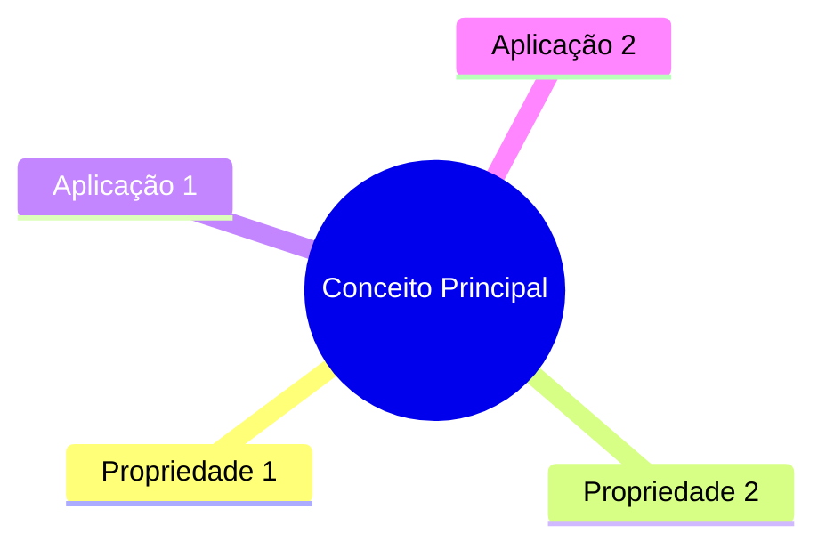

# Templates Base

### 📘 Template A: CURSO TÉCNICO

**Características:**
- Foco em implementação e código
- Muitos exemplos práticos
- Análise linha por linha
- Exercícios de codificação

**Módulos Recomendados:**
- ✅ Análise de Código (obrigatório)
- ✅ Diagramas (recomendado)
- ✅ Exercícios (recomendado)
- ⚪ Glossário (opcional)
- ⚪ Fórmulas (se tiver análise de complexidade)
- ⚪ Referências (opcional)
- ⚪ Mídia (opcional)

**Estrutura do Arquivo de Conteúdo:**

```markdown
# EMOJI Nome do Tópico

> ⏱️ **Tempo total de estudo:** Xh Ymin (N aulas)

## Sumário

| # | Aula | Tempo | Dificuldade |
|---|------|-------|-------------|
| XX | [Título da aula](#aula-xx-título-da-aula) | Xh Ymin | Básica/Intermediária/Avançada |

---

## Aula XX: [Algoritmo/Estrutura]
📅 Data de Adição: DD/MM/AAAA
⏱️ Tempo Estimado de Estudo: Xh Ymin
📊 Dificuldade: Básica/Intermediária/Avançada

### 📌 Objetivos
- [ ] Entender o funcionamento do [algoritmo]
- [ ] Implementar em [linguagem]
- [ ] Analisar complexidade

### 🎯 Conceito

[Explicação teórica breve]

### 💻 Implementação

#### Versão Básica

```[linguagem]
[código comentado linha por linha]
```

**Análise:**
- Linha X: [explicação]
- Linha Y: [explicação]

**Complexidade:** O(?)

#### Exercícios de Implementação

🟢 **Básico:** Modifique a função para...

<details>
<summary>💡 Ver Solução</summary>

```[linguagem]
[código da solução]
```

**Explicação:** ...

</details>

### 🔍 Quando Usar

✅ Use este [algoritmo/estrutura] quando:
- Condição 1
- Condição 2

❌ Evite quando:
- Situação 1
- Situação 2

### 📊 Comparação com Alternativas

| Característica | Este | Alternativa 1 | Alternativa 2 |
|---|---|---|---|
| Tempo | | | |
| Espaço | | | |

### 📖 Glossário

<details>
<summary>Termos desta aula</summary>

- **Termo 1:** Definição
- **Termo 2:** Definição

</details>
```

**Proporções de Conteúdo:**
- 60% Código e implementação
- 25% Explicações teóricas
- 15% Exercícios e comparações

---

### 📚 Template B: CURSO TEÓRICO

**Características:**
- Foco em conceitos e fundamentos
- Demonstrações matemáticas
- Provas e teoremas
- Pouquíssimo ou nenhum código

**Módulos Recomendados:**
- ⚪ Análise de Código (não)
- ✅ Diagramas (para conceitos abstratos)
- ✅ Exercícios (teóricos)
- ✅ Glossário (obrigatório)
- ✅ Fórmulas (se tiver matemática)
- ✅ Referências (recomendado)
- ⚪ Mídia (opcional)

**Estrutura do Arquivo de Conteúdo:**

```markdown
# EMOJI Nome do Tópico

> ⏱️ **Tempo total de estudo:** Xh Ymin (N aulas)

## Sumário

| # | Aula | Tempo | Dificuldade |
|---|------|-------|-------------|
| XX | [Título da aula](#aula-xx-título-da-aula) | Xh Ymin | Básica/Intermediária/Avançada |

---

## Aula XX: [Conceito/Teoria]
📅 Data de Adição: DD/MM/AAAA
⏱️ Tempo Estimado de Estudo: Xh Ymin
📊 Dificuldade: Básica/Intermediária/Avançada

### 📌 Objetivos
- [ ] Compreender o conceito de [X]
- [ ] Relacionar com [Y]
- [ ] Aplicar em [contexto]

### 🎯 Introdução

[Contextualização e motivação]

### 📖 Definição Formal

> **Definição [X]:**
> [Definição matemática/formal]

**Em outras palavras:** [Explicação simplificada]

### 🔍 Propriedades

#### Propriedade 1: [Nome]

**Enunciado:** ...

**Demonstração:**

1. Premissa inicial: ...
2. Passo 2: ...
3. Conclusão: ∴ ...

**Exemplo ilustrativo:**

[Exemplo concreto]

### 💡 Intuição

[Explicação conceitual, analogias]



### ✏️ Exercícios Conceituais

🟢 **Básico:** Defina com suas palavras...

<details>
<summary>💡 Ver Resposta</summary>

**Resposta:** ...

</details>

### 📖 Glossário

<details>
<summary>Termos desta aula</summary>

- **Termo 1:** Definição
- **Termo 2:** Definição

</details>
```

**Proporções de Conteúdo:**
- 60% Explicações conceituais
- 20% Demonstrações/provas
- 15% Exercícios teóricos
- 5% Relações e contexto

---

### ⚖️ Template C: CURSO HÍBRIDO

**Características:**
- Balanceamento entre teoria e prática
- Conceitos seguidos de implementações
- Análise teórica + código
- Aplicações reais

**Módulos Recomendados:**
- ✅ Análise de Código (recomendado)
- ✅ Diagramas (obrigatório)
- ✅ Exercícios (mistos)
- ✅ Glossário (recomendado)
- ⚪ Fórmulas (se aplicável)
- ⚪ Referências (opcional)
- ⚪ Mídia (opcional)

**Estrutura do Arquivo de Conteúdo:**

```markdown
# EMOJI Nome do Tópico

> ⏱️ **Tempo total de estudo:** Xh Ymin (N aulas)

## Sumário

| # | Aula | Tempo | Dificuldade |
|---|------|-------|-------------|
| XX | [Título da aula](#aula-xx-título-da-aula) | Xh Ymin | Básica/Intermediária/Avançada |

---

## Aula XX: [Tópico]
📅 Data de Adição: DD/MM/AAAA
⏱️ Tempo Estimado de Estudo: Xh Ymin
📊 Dificuldade: Básica/Intermediária/Avançada

### 📌 Objetivos
- [ ] Compreender teoria de [X]
- [ ] Implementar [X] em [linguagem]
- [ ] Analisar performance

### 🎯 Parte 1: Fundamentos Teóricos

#### Conceito

[Explicação conceitual]

**Formalização:**

$$
[fórmula matemática se aplicável]
$$

#### Propriedades

- Propriedade 1
- Propriedade 2

#### Exercícios Teóricos

🟢 **Básico:** [pergunta conceitual]

🟡 **Intermediário:** [análise teórica]

### 💻 Parte 2: Implementação Prática

#### Algoritmo

**Pseudocódigo:**

```
ALGORITMO [Nome]
ENTRADA: ...
SAÍDA: ...

1. Passo 1
2. Passo 2
3. ...
```

**Análise de Complexidade:**
- Tempo: O(?)
- Espaço: O(?)
- Justificativa: ...

#### Código Completo

```[linguagem]
[implementação comentada]
```

**Pontos-chave:**
- Linha X: [explicação técnica]
- Linha Y: [por que esta escolha]

#### Exercícios Práticos

🟢 **Básico:** Implemente variação...

🟡 **Intermediário:** Otimize para...

🔴 **Avançado:** Generalize para...

### 🔄 Parte 3: Integração

#### Conexão Teoria ↔ Prática

[Como a teoria se manifesta no código]

#### Diagrama Completo

```mermaid
flowchart TD
    [diagrama integrando conceitos e fluxo]
```

#### Aplicações Reais

1. **Caso de uso 1:** [onde é usado]
2. **Caso de uso 2:** [exemplo real]

### 📖 Glossário

<details>
<summary>Termos desta aula</summary>

- **Termo técnico 1:** Definição
- **Termo técnico 2:** Definição

</details>
```

**Proporções de Conteúdo:**
- 40% Teoria e conceitos
- 40% Código e implementação
- 20% Exercícios e aplicações
